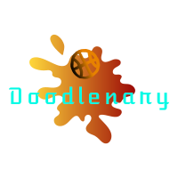

<h2><u>Overview:</u><h2>
<h4>Doodlenary is a guess the drawing style game. An "artist" will be chosen at random to pick a word and draw on the canvas. Other players in the lobby will attempt to guess what the artist is drawing. Points will be awarded depending on how quickly players can guess what the artist is drawing.</h4>

</br>

<h2><u>The Team:</u></h2>

<h3>Claude Major</h3>
<b>Primary team role:</b> 
</br>

<h3>Zachary Akers</h3>
<b>Primary team role:</b>
</br>

<h3>Cedael White</h3>
<b>Primary team role:</b>

<h3>Matt Phillips</h3>
<b>Primary team role:</b>

</br>
</br>
</br>

<h2><u>Tools used in the project:</u></h3>
<h3>Languages:</h3>
<ul>
    <li>HTML</li>
    <li>CSS</li>
    <li>JavaScript</li>
</ul>

Other:

<ul>
    <li>JQuery</li>
    <li>JSON</li>
    <li>Bootstrap</li>
    <li>FontAwesome</li>
    <li>NodeJS</li>
    <li>PostgreSQL</li>
    
</ul>

<br>


<h3><u>MVP:</u></h3>
<ul>
    <li>Index, Registration, Login, and Game pages</li>
    <li>Database with encryption and authentication</li>
    <li>Game page with canvas, lobby, and chat</li>
    
    
    
</ul>

</br>

<h2><u>Flex Goals Completed:</u></h2>
<ul>
    <li>Client side Leaderboard</li>
</ul>

</br>


<h2><u>Challenges & Solutions:</u><h2>
<h3>Some of the biggest challenges we faced with this project build included:</h2>

<b>Challenge: </b>
<br>
<b>Solution:</b>

<b>Challenge: </b>
<br>
<b>Solution: </b>

<b>Challenge: </b>
<br>
<b>Solution: </b>

<b>Challenge: </b>
<br>
<b>Solution: </b>

</br>

<h2><u>Code Snippets:</u></h2>

### Adds the visual chat message to the message list</h4>
``` javascript
    // Adds the visual chat message to the message list
    const addChatMessage = (data, options) => {
        // Don't fade the message in if there is an 'X was typing'
        var $typingMessages = getTypingMessages(data);
        options = options || {};
        if ($typingMessages.length !== 0) {
            options.fade = false;
            $typingMessages.remove();
        }

        var formattedUsername;
        if (options.typingMessage) {
            formattedUsername = data.username + ' ';
        } else {
            formattedUsername = data.username + ': ';
        }

        var $usernameDiv = $('<span class="username"/>')
            .text(formattedUsername)
            .css('color', getUsernameColor(data.username));

        var $messageBodyDiv = $('<span class="messageBody">')
            .text(data.message);

        var typingClass = data.typing ? 'typing' : '';
        var $messageDiv = $('<li class="message"/>')
            .data('username', data.username)
            .addClass(typingClass)
            .append($usernameDiv, $messageBodyDiv);

        addMessageElement($messageDiv, options);
    }
``` 
### Stop the current game, correctGuessPlayer = player that guessed the word. If correctGuessPlayer == null, nobody guessed the word</h4>
 ``` javascript  
    //Stop the current game, correctGuessPlayer = player that guessed the word. If correctGuessPlayer == null, nobody guessed the word
    function stopGameEngine(correctGuessPlayer) {
     logMessage("Game Stopped.");
        if (correctGuessPlayer != null) {
            // Somebody guessed the word (correctGuessPlayer != null)
         var points = timeRemaining; // Points are the time remaining on the round timer
            playerQueue.forEach(function (element) {
                element.emit('chat_instruction', "Round over! " + drawingPlayer.username + " earned " + points + " points.");
                 element.emit('chat_instruction', correctGuessPlayer.username + " Guessed the word: " + randomWord + " correctly\n" +
                 "and earned " + points + " points.");
        });
        drawingPlayer.emit('chat_instruction', "Round over! You've earned " + points + " points.");
        drawingPlayer.emit('chat_instruction', correctGuessPlayer.username + " Guessed the word: " + randomWord + " correctly\n" +
            "and earned " + points + " points.");

        // Point rollout and highscores
        if (highscores.hasOwnProperty(correctGuessPlayer.username)) {
            highscores[correctGuessPlayer.username] = highscores[correctGuessPlayer.username] + points;
        } else {
            highscores[correctGuessPlayer.username] = points;
        }

        if (highscores.hasOwnProperty(drawingPlayer.username)) {
            highscores[drawingPlayer.username] = highscores[drawingPlayer.username] + points;
        } else {
            highscores[drawingPlayer.username] = points;
        }
    } else {
        // No one guessed the word (correctGuessPlayer == null)
        playerQueue.forEach(function (element) {
            element.emit('chat_instruction', "No one guessed the word " + randomWord + " Nobody earns points.");
        });
        if (drawingPlayer != null) {
            drawingPlayer.emit('chat_instruction', "No one guessed the word " + randomWord + " Nobody earns points.");
        }
    }
```

## Acknowledgments

Doodlenary was inspired by skribbl.io

